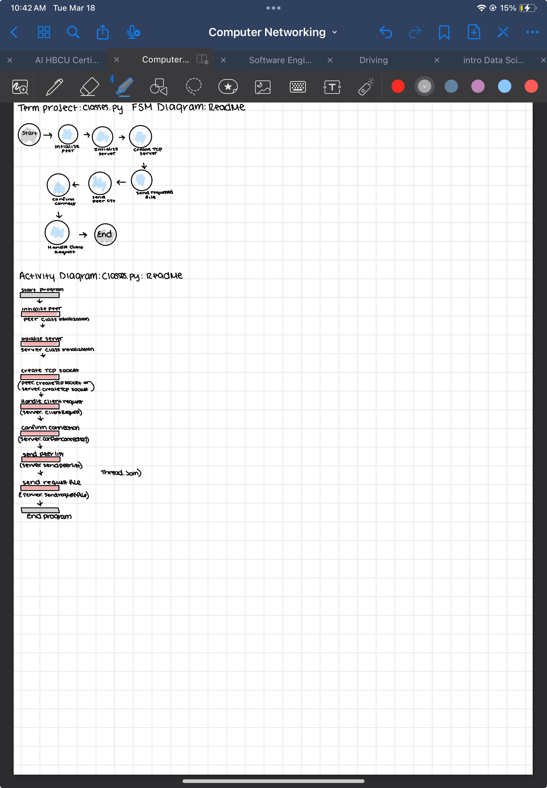

# Group-5_netwoking_Term-Project
computer networking Term Project 

 Main.py FSM Diagram:
The diagram represents a Finite State Machine 
(FSM) for the main.py module.
States include:
Start --> User input --> Pinpoint -->
--> Server listening --> Peer listening -->
--> Connect --> Server running --> End

Threads synchronized

Activity Diagram: Main.py Module:

The activity diagram describes 
the flow of the program:

Start the program.
prompt the user to validate an utterance.
Prompt and validate the IP address.
Start the server thread.
Perform final conversion.
Start the peer thread.
Wait for threads to join (server and peer threads).
Program completion.

