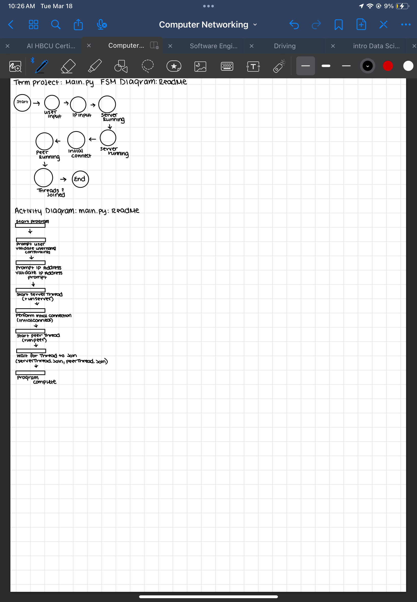

# Group-5_netwoking_Term-Project
computer networking Term Project

 Main.py FSM Diagram:
The diagram represents a Finite State Machine 
(FSM) for the main.py module.
States include:
Start --> User input --> Pinpoint -->
--> Server listening --> Peer listening -->
--> Connect --> Server running --> End

Threads synchronized

Activity Diagram: Main.py Module:
