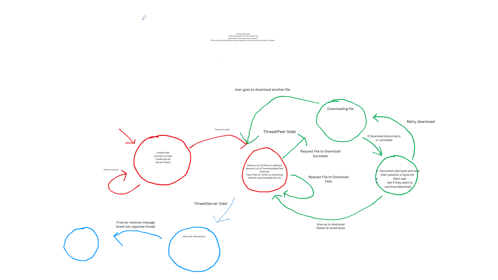

# Group-5_netwoking_Term-Project

python version 3.12

# P2P Network Capabilities
> 1. File downloads
> 2. File synchronization

# To Note Before Beginning
> - When downloading a file, it won't show in the until AFTER you stop
> the IDE until after you stop program. You should see it in the files
> though.
> - If you encounter connection problems try using terminal to ping to
> other computer to ensure it's an application problem.

# If using windows, everything will give you problems
> Here's a checklist to ensure your windows machine can use our p2p
> network
> 1. Go to command and try pinging the other computer
> on a local network. Make sure to use the local IP address
> 2. Make sure your windows machine identifies the network as private
> and ENABLE FILE AND PRINTER SHARING
> 3. If File and Printer sharing was off and you turned it off,
> make sure to restart your device. 

# Steps to Running P2P Network
> 1. Go to terminal and type "ipconfig getifaddr en0" (or for windows
> "ipconfig" and find the IPv4 Address). This will be your IP address.
> 2. Before running the program change the global variables:
> - G_USER_IP - Your IP address
> - G_USER_USERNAME - Your Username
> - g_server_ip - The server's IP address
> 3. Any files you want available for download, put in the Files folder 
>of your IDE.
> 4. Any files that you want available for synchronization, put in the 
> SyncFiles folder
> 5. Start the program and wait if you are the first person to connect
> 6. Once the second person connects to your server, that confirms 
> their server is online, and you are ready to connect

# For A-lee-a when you do documentation
> In case I forget, I'll list the major processes here and try to break
> down everything as simple as possible so presenting is easy. There is 
> no particular order of any of these, it's just stuff that should be 
> covered in slides or diagrams
> - (Clarification) Any peer currently in the P2P network ALWAYS has
> its server on (runServer). The client side only connects to a server
> when a user makes an explicit request for server info (file downloads,
> peer list requests, synchronization, etc...)
> - At least 2 users need to be online in order for the P2P network to 
> function. The first user needs to start their server THEN WAIT for
> the second client to connect their server. Only then should the first
> client attempt to connect to the second client
> - Every file is sent through bits
> - The user has these available options
> - 1. View Available Peers in Network
>   2. View Available Files in Network
>   3. Download Available Files

## Documentation Requirements 
> # Design Process
> The design process throughout this project was difficult to come up with to say the least.
> In the beginning a lot of our time was spent on learning how to do what and then later 
> implementing it. After about two weeks of learning, we began designing our P2P network 
> using a finite state machine.
> 
> 
> 
> This was our initial finite state machine (later remodeled and beautified by Aalia Bello).
> From this model we understood how we would go on implementing out P2P network, but the
> implementation itself was challenging. Our main challenges consisted of:
> 1. Each function relied heavily on other functions 
>   - For example: Let's say person A was assigned the task of sending files to the directory. 
>   Person B was assigned of sending updates to synced files. Because these are similar task, 
>   they end up reinventing the wheel. This bloats code and causes confusion.
> 2. We didn't agree on naming conventions
>   - Though this won't break the code, it does increase the amount of time needed to create 
>   code. Some developers expect functions to be in camel-case, while others expect it in
>   snake_case. If we ever continued the project we would definitely make sure to discuss this
> 3. We've never built a P2P network before
>   - Each of us has never built a P2P network before, so there were many pitfalls we fell in
>   to during this project. The most noteable one being, different results using different OS
>   systems. We felt it was unacceptable for our code only to work between two different OS's,
>   so we not only needed to find the cause of the issue, but also refactor completely to solve
>   it.
> 4. Documenting our work for grades
>   - If this project was simply between the four of us, we could have pushed issues no problem,
>   but in school and the real world this is often not the case. We struggled to remember to make
>   branches for issues we've done and as a result lost out on points we could have had. 
> 
> After encountering each of these issues, we figured it was best to split out work in sessions.
> No two people work on code at the same time. We did not know what was needed for each task, so 
> there was to prevent code duplication. By splitting up our work in to sessions, we avoid this
> entirely. Think of it as a work schedule.
> 
> ### Scrum Methodology
> We made sure to combine our new methodology with our previous Scrum strategy to stay 
> consistent to what we know. The roles consisted of
> 
> - Scrum Master - Brejon Turner
> - Product Owner - Aalia Bello
> - Development Team - Carlos Hernandez, Colton Callueng, Aalia Bello, Brejon Turner
> 
> ### Strengths and Weaknesses of Each Member
> - `Brejon` had the most time to work on the project and works in large sessions, so Scrum Master
> was the role that fit him best. When a problem occurred between two branches, it will be solved
> when handed to him. 
> - `Aalia` is the best at organization and readability in terms of the Scrum board. She also had
> the best understanding of the problem and what work needed to be prioritized
> - `Carlos` was very efficient at producing code. Any task given to him was completed the week of.
> All that was left to do with his code was adjusting it to match other merges.
> - `Colton` was responsible for the handling edge cases of the network, such as:
>   - Network failure
>   - Retransmissions in case of network failure
>   - File Sync conflict resolution
>   
>    He was able to come up with multiple ideas that are great to implement in a P2P
>       network.
> 
> By doing this, we were able to push out code effectively
> and managed to refactor the entire codebase in to a more readable and scalable application. 
>
> # Our designed Protocol
> 
> 

### Computer Networking Term Project 

 Main.py FSM Diagram:
The diagram represents a Finite State Machine 
(FSM) for the main.py module.
States include:
Start --> User input --> Pinpoint -->
--> Server listening --> Peer listening -->
--> Connect --> Server running --> End

Threads synchronized

Activity Diagram: Main.py Module:

The activity diagram describes 
the flow of the program:

Start the program.
prompt the user to validate an utterance.
Prompt and validate the IP address.
Start the server thread.
Perform final conversion.
Start the peer thread.
Wait for threads to join (server and peer threads).
Program completion.

The provided diagrams and code defines 
three classes—Peer, Server, and File—for 
a peer-to-peer file-sharing system. 
The Peer class represents a network peer, 
capable of creating a TCP socket, managing shared files, 
toggling its online status, and sending messages. 
It maintains a list of File objects, which store file names, timestamps, and path information.
The Server class sets up a TCP socket bound to a specific address, acting as a central point for peer connections. 
The File class encapsulates file details, including whether the file name represents a path, 
and allows updates to the file name and timestamp.

The system’s activity diagram involves peers creating sockets, sharing files, and communicating with the server, 
while the finite state machine (FSM) includes states like Online/Offline for peers and Listening for the server. 
The File class manages states related to file paths and updates. Although the code provides a foundational structure, 
it lacks full implementation details, such as handling incoming connections and messages, which are essential for a functional peer-to-peer network.