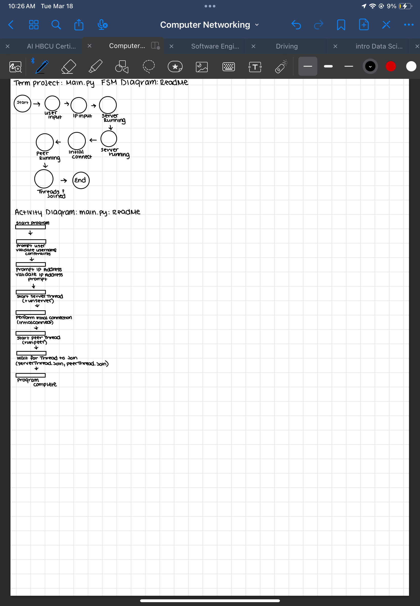
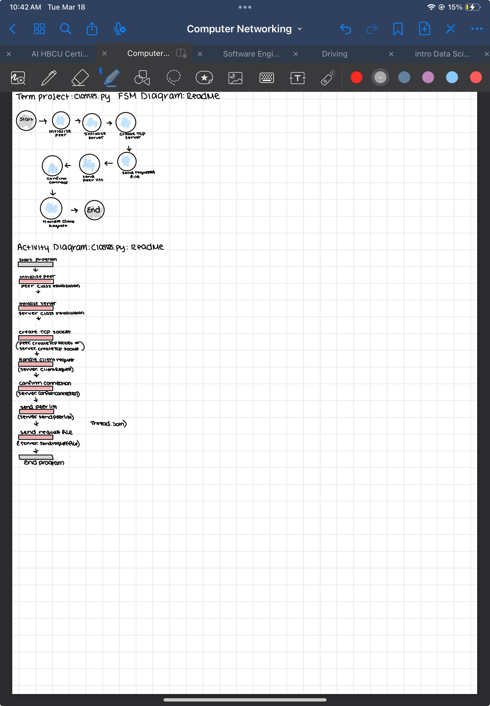

# Group-5_netwoking_Term-Project
computer networking Term Project 

 Main.py FSM Diagram:
The diagram represents a Finite State Machine 
(FSM) for the main.py module.
States include:
Start --> User input --> Pinpoint -->
--> Server listening --> Peer listening -->
--> Connect --> Server running --> End

Threads synchronized

Activity Diagram: Main.py Module:

The activity diagram describes 
the flow of the program:

Start the program.
prompt the user to validate an utterance.
Prompt and validate the IP address.
Start the server thread.
Perform final conversion.
Start the peer thread.
Wait for threads to join (server and peer threads).
Program completion.

The provided diagrams and code defines 
three classes—Peer, Server, and File—for 
a peer-to-peer file-sharing system. 
The Peer class represents a network peer, 
capable of creating a TCP socket, managing shared files, 
toggling its online status, and sending messages. 
It maintains a list of File objects, which store file names, timestamps, and path information.
The Server class sets up a TCP socket bound to a specific address, acting as a central point for peer connections. 
The File class encapsulates file details, including whether the file name represents a path, 
and allows updates to the file name and timestamp.

The system’s activity diagram involves peers creating sockets, sharing files, and communicating with the server, 
while the finite state machine (FSM) includes states like Online/Offline for peers and Listening for the server. 
The File class manages states related to file paths and updates. Although the code provides a foundational structure, 
it lacks full implementation details, such as handling incoming connections and messages, which are essential for a functional peer-to-peer network.